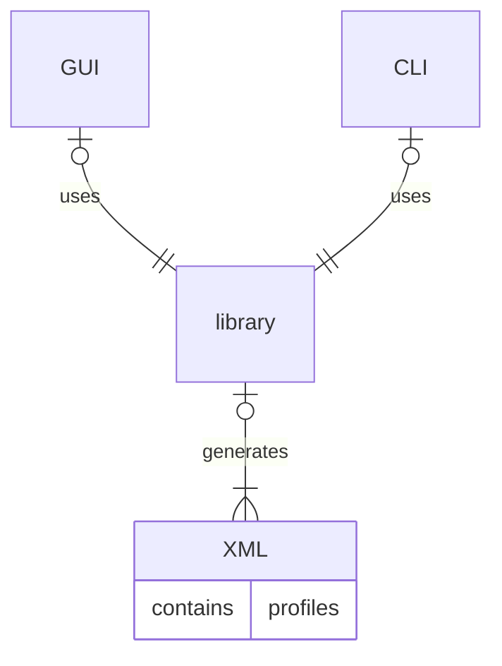

# Fast-DDS-QoS-Profiles-Manager

eProsima's Fast DDS QoS Profiles Manager is a set of tools for the generation of XML files containing Fast DDS profile definitions.

The set includes, under `lib/` folder, the library that generates the XML profile files, exposing API calls to configure the desired profiles.
Under `cli/` folder, a command line interface library provides the possibility of setting simple instructions via command line to configure the desired profiles.
Under `gui/` folder, a graphical user interface allows to graphically configure the desired profiles in a simple form layout. The interface guides the user to complete the profile data, highlighting missing fields and displaying their default values.

Both CLI and GUI makes use of the provided library.
See below a simpe graphic of the interactions between each element.

## Commercial support

Looking for commercial support? Write us to info@eprosima.com

Find more about us at [eProsima’s webpage](https://eprosima.com/).
