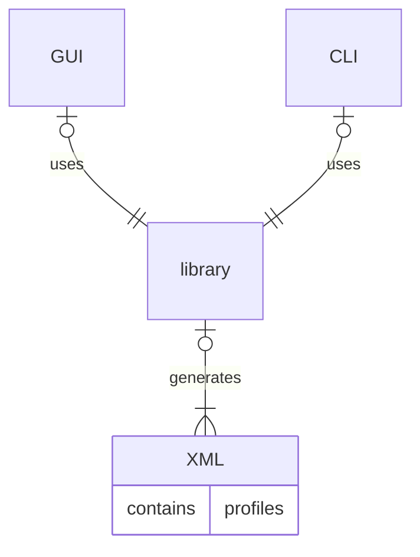

# Fast-DDS-QoS-Profiles-Manager

This repository holds a set of tools for the generation of XML files containing Fast DDS profile definitions.

The set includes, under `lib/` folder, the library that generates the XML profile files, exposing APIs to configure the desired profiles.
Under `cli/` folder, a command line interface library provides the possibility of setting simple instructions via command line to configure the desired profiles.
Under `gui/` folder, a graphical user interface provides that, in order to graphically configure the desired profiles while whatching the changes interactively before saving the XML file.

Both CLI and GUI makes use of the provided library.
See below a simpe graphic of the interactions between each element.

